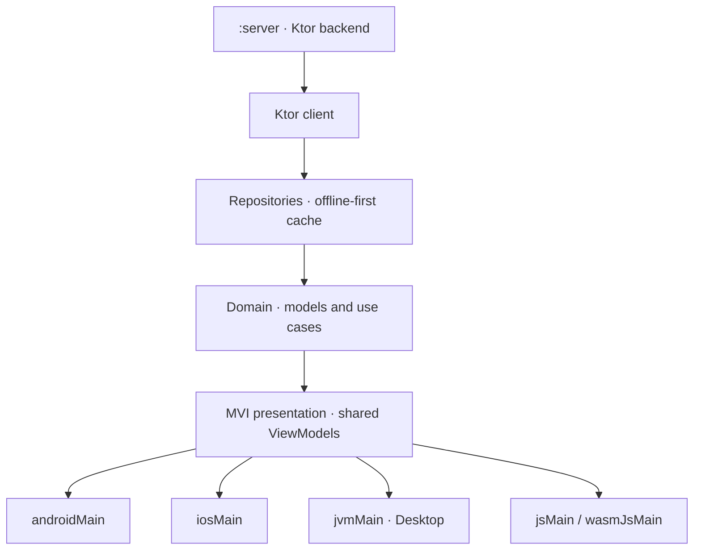

# Mahmoud I. Khalil

**Senior Mobile Engineer — Android · iOS · Kotlin Multiplatform**

I build production mobile apps across Android, iOS, and Kotlin Multiplatform. My work spans consumer products used by millions, enterprise tools inside a national telecom, and shared Kotlin codebases that ship to four platforms from one source set.

  

[Email](mailto:mahmoudibrahimabdulfattah@gmail.com) · [LinkedIn](https://www.linkedin.com/in/mahmoudibrahimabdulfattah/) · [Portfolio](https://mahmoudibrahimabdulfattah.github.io/) · [CV](https://drive.google.com/file/d/1USHmdcAgjljq444uuJswfn3VPDF88FA0/view?usp=drive_link)

| 6+ years | Android · iOS · KMP | 10M+ downloads | 7+ apps |
|:--|:--|:--|:--|
| Professional experience | Cross-platform delivery | WeightWatchers on Google Play | Shipped to production |

## Code to inspect

| Inspect | What it shows |
|:--|:--|
| [NewsShortsCMP](https://github.com/mahmoudibrahimabdulfattah/NewsShortsCMP) | Kotlin Multiplatform across Android, iOS, Desktop and Web from one codebase; Clean Architecture with MVI, Koin Multiplatform, Ktor client, offline-first caching, and a dedicated Ktor `:server` module. |
| [Mahmoud-Ibrahim-CV](https://github.com/mahmoudibrahimabdulfattah/Mahmoud-Ibrahim-CV) | Compose Multiplatform on four targets with full Arabic and RTL, light and dark schemes, and platform-specific navigation. |
| Store releases | Production delivery at consumer and enterprise scale — see the work table below. |

> [!NOTE]
> Client and employer work ships to Google Play but the source is closed. The two GitHub
> repositories above are mine end to end and are the code to read.

## Selected work

<table>
  <tr>
    <td width="50%" valign="top">
      <h3><a href="https://play.google.com/store/apps/details?id=com.weightwatchers.mobile">WeightWatchers</a></h3>
      <p>Food, activity, and weight tracking used by millions worldwide.</p>
      <p>
        
        
        
      </p>
    </td>
    <td width="50%" valign="top">
      <h3><a href="https://play.google.com/store/apps/details?id=com.ispace.sgs.app">SGS Super App</a></h3>
      <p>AI-enhanced employee self-service for Saudi Ground Services.</p>
      <p>
        
        
        
      </p>
    </td>
  </tr>
  <tr>
    <td width="50%" valign="top">
      <h3><a href="https://github.com/mahmoudibrahimabdulfattah/NewsShortsCMP">News Shorts</a></h3>
      <p>Kotlin Multiplatform news app with TikTok-style vertical browsing and offline-first architecture.</p>
      <p>
        
        
        
      </p>
    </td>
    <td width="50%" valign="top">
      <h3><a href="https://play.google.com/store/apps/details?id=com.ispace.mentorship.app">Smart Mentor</a></h3>
      <p>Mentorship platform with real-time chat, video sessions, and session booking.</p>
      <p>
        
        
        
      </p>
    </td>
  </tr>
</table>

<details>
<summary>Five more shipped projects</summary>

| Product | What it demonstrates | Stack |
|:--|:--|:--|
| [WE Attend](https://play.google.com/store/apps/details?id=com.we.weAttend) | Attendance management for 2,000+ Telecom Egypt employees. | Kotlin, MVVM, Firebase |
| [WE HR](https://play.google.com/store/apps/details?id=com.we.teamcare) | Employee self-service portal for HR requests and payslips. | Kotlin, MVVM, Firebase |
| [Interactive CV](https://github.com/mahmoudibrahimabdulfattah/Mahmoud-Ibrahim-CV) | One Compose Multiplatform CV across four platforms, with Arabic and RTL. | KMP, Compose, i18n |
| Mystery Shopper | Structured branch evaluations with offline-first capture and sync. | Kotlin, MVI, Room · Internal |
| Data Cleansing | Field documentation of network cabinets for Telecom Egypt technicians. | Kotlin, MVI, Room · Internal |

</details>

## Shared KMP architecture

Source layout of the [Interactive CV](https://github.com/mahmoudibrahimabdulfattah/Mahmoud-Ibrahim-CV) repository linked above:

```
composeApp/src/
├── commonMain/          # domain, data, presentation, theme — one source of truth
│   └── com/mif/mahmoudcv/
│       ├── domain/      # models
│       ├── data/        # CvDataProvider, Strings, SettingsManager
│       ├── presentation/# screens, components, navigation
│       └── theme/       # colour roles, typography, light and dark schemes
├── androidMain/         # Activity, system bars, dialer and intent actuals
├── iosMain/             # UIViewController, system bars, UIApplication actuals
├── jvmMain/             # desktop entry point
├── jsMain/  wasmJsMain/ # web entry points
└── commonTest/
```



- Platforms: Android, iOS, Desktop (JVM), Web (JS + WASM)
- Architecture: Clean Architecture, MVI, Koin Multiplatform, Ktor Client, Coroutines
- Offline-first: Persistent local caching, background refresh, shared platform-agnostic ViewModels
- Localization: Full RTL support with Arabic and English UI
- Backend: A dedicated Ktor `:server` module serving the feed
- Startup: Reduced measured splash duration from roughly 1.2s to 450ms.

## Engineering depth

| Area | Contents |
|:--|:--|
| Mobile platforms | Kotlin, Jetpack Compose, Swift, SwiftUI, Java, and Compose Multiplatform. |
| Architecture | Clean Architecture, MVI, MVVM, SOLID, multi-module systems, and dependency injection. |
| Quality and delivery | Unit and UI testing, CI/CD, performance tuning, Crashlytics, code review, and mentoring. |
| Integrations | REST APIs, offline-first data, Firebase, push notifications, maps, SAP WCF, and AI SDKs. |

## Production experience

| Period | Title | Company |
|:--|:--|:--|
| 05/2026 – Present | Senior Mobile Engineer (Android & iOS) | Telecom Egypt |
| 08/2025 – 05/2026 | Senior Android Engineer | WeightWatchers |
| 06/2024 – 08/2025 | Senior Android Engineer (Part-time) | iSpace Technology |
| 01/2023 – 08/2025 | Senior Android Engineer | Telecom Egypt |
| 12/2021 – 01/2023 | Android Engineer | Spirit for Consultancy Services |

<details>
<summary>Full accomplishment details</summary>

### Senior Mobile Engineer (Android & iOS) · Telecom Egypt

- Moved to the iOS team in May 2026 after six years of Android work; build native iOS features in Swift and SwiftUI.
- Ship features on both platforms: Kotlin and Jetpack Compose on Android, Swift and SwiftUI on iOS.
- Keep architecture consistent across both codebases with Clean Architecture and MVVM/MVI.
- Coordinate with product, backend, and QA to align features and releases across Android and iOS.

### Senior Android Engineer · WeightWatchers

- Built and maintained the official WeightWatchers app, a consumer product with 10M+ downloads used by millions worldwide.
- Shipped new features and UI flows in Kotlin and Jetpack Compose for the food and activity tracking experience.
- Collaborated with product, design, and backend teams on scalable food and activity tracking.
- Worked within Clean Architecture and MVI/MVVM, adding unit and UI tests that brought the crash rate down.

### Senior Android Engineer (Part-time) · iSpace Technology

- Architected the SGS Super App and integrated conversational AI features through the Labiba SDK.
- Led performance optimizations and third-party SDK integrations across multiple Android apps.
- Applied multi-module Clean Architecture with Kotlin Flow, reducing bug recurrence by 25%.

### Senior Android Engineer · Telecom Egypt

- Led development of 5+ internal Android apps serving 2,000+ employees across field operations and HR.
- Collaborated with cross-functional teams across product, backend, and QA, maintaining 95%+ sprint completion.
- Architected scalable multi-module Clean Architecture, enabling 30% faster feature delivery.
- Increased test coverage and reduced manual testing effort by 25%.

### Android Engineer · Spirit for Consultancy Services

- Shipped 3+ Android apps from concept to production.
- Owned the Smart Sales app end to end, resolving critical bugs and improving user satisfaction.
- Integrated apps with SAP systems through C# WCF for real-time cross-platform data sync.

</details>

## Elsewhere

The portfolio site carries the same work with the delivery detail and an Arabic edition;
the CV app is the Compose Multiplatform build of it, running on four targets.

[Email](mailto:mahmoudibrahimabdulfattah@gmail.com) · [LinkedIn](https://www.linkedin.com/in/mahmoudibrahimabdulfattah/) · [Portfolio](https://mahmoudibrahimabdulfattah.github.io/) · [CV](https://drive.google.com/file/d/1USHmdcAgjljq444uuJswfn3VPDF88FA0/view?usp=drive_link)
